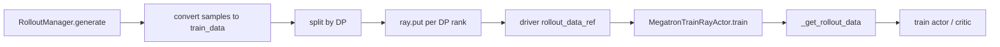
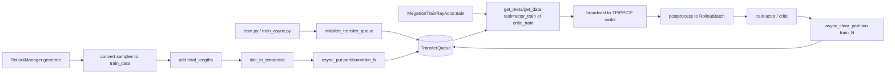
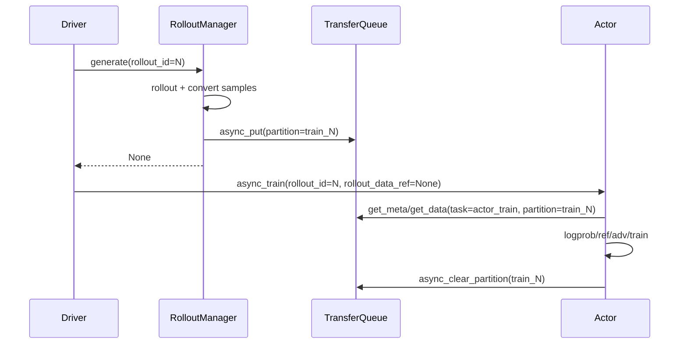
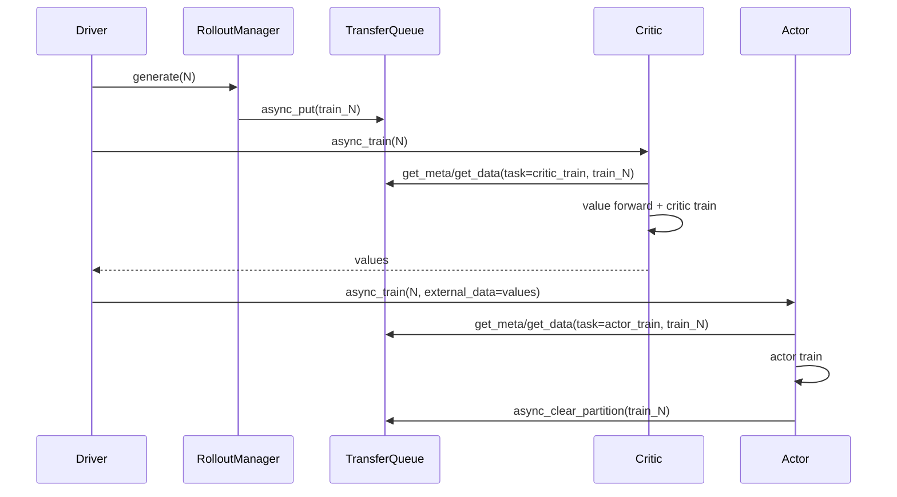

# slime TransferQueue 适配设计文档

## 1. 背景

slime 原有 rollout 到 training 的数据路径是基于 Ray Object Store 的 step 级传递：

1. `RolloutManager.generate(rollout_id)` 调用 rollout function 生成 `Sample`。
2. `RolloutManager._convert_samples_to_train_data()` 将 `Sample` 转成 `dict` 格式的训练数据。
3. `RolloutManager._split_train_data_by_dp()` 按 DP rank 切分数据，并用 `ray.put()` 得到每个 DP rank 对应的 `ObjectRef`。
4. driver 将 `rollout_data_ref` 传给 actor/critic 的 `async_train()`。
5. `MegatronTrainRayActor._get_rollout_data()` 从 Ray Object Store 读取本 DP rank 数据，再搬到 GPU 训练。

该路径简单直接，但 rollout 与 training 的数据平面和控制平面绑定得比较紧：

- 数据必须先在 `RolloutManager.generate()` 中完整构造，再返回给 driver。
- driver 需要显式携带 `rollout_data_ref`。
- 数据生命周期依赖 Ray ObjectRef，无法自然表达 partition、consumer cursor、staleness/backpressure 等语义。
- 后续如果要演进为更强的异步或多角色数据流，需要重新设计数据传输协议。

Relax 的 TransferQueue 适配提供了一个更清晰的数据平面模型：以 `partition_id=train_{rollout_id}` 表示训练 step，以 `task_name` 表示消费角色，通过 TransferQueue metadata 追踪字段就绪、采样进度和消费状态。

本设计将这一模型移植到 slime，但保持 slime 当前主训练流程不被大幅重构。

## 2. 目标

本次适配目标：

- 在 slime 内部支持 TransferQueue 作为 rollout-to-training 数据平面。
- 保持默认行为不变；只有显式启用 `--use-transfer-queue` 时才走 TQ。
- 架构上对齐 Relax 的核心契约：
  - `partition_id = train_{rollout_id}`
  - rollout 写入初始训练字段
  - actor/critic 以 `task_name` 消费同一 partition
  - 训练完成后清理 partition
  - 使用 staleness 控制 rollout 生产速度
- 实现上尽量小而清楚：
  - 不引入 Ray Serve 服务化体系。
  - 不拆分独立 ActorFwd / Reference / Advantage 服务。
  - 不改变 Megatron 原有训练、logprob、advantage 计算位置。
  - 不影响现有 Ray ObjectRef 路径。

## 3. 非目标

本次适配不做以下事情：

- 不实现 Relax fully-async 五角色拓扑。
- 不实现独立的 ActorFwd、Reference、Advantages 服务。
- 不实现 TQ StreamingDataLoader 级别的 microbatch 流式消费。
- 不改变 SGLang 侧 PD transfer queue 或 KV transfer 逻辑。
- 不替代现有 `train_async.py` 的预取式异步 rollout。
- 不要求所有用户安装 TransferQueue；默认路径仍不依赖外部 `transfer_queue` 包。

## 4. 总体架构

### 4.1 原有 Ray ObjectRef 路径



### 4.2 TransferQueue 路径



### 4.3 设计原则

- TransferQueue 只承载数据平面，不改变训练控制流。
- driver 仍按 `rollout_id` 调用 `generate()` 和 `async_train()`。
- `rollout_data_ref` 在 TQ 模式下可以是 `None`，actor/critic 根据 `rollout_id` 自行从 TQ 获取数据。
- TQ 相关逻辑集中在一个 slime 内部适配层，避免散落在 rollout、actor、driver 中。
- 可选字段按配置请求，避免 actor 从 TQ 等待一个并不存在的字段。

## 5. 模块划分

### 5.1 `slime.utils.transfer_queue`

建议集中放置所有 TransferQueue 适配代码。该模块是 slime 与外部 `transfer_queue` 包之间的唯一直接边界。

职责：

- 懒加载外部 `transfer_queue` 包。
- 初始化 TQ controller/storage 配置。
- 为 Ray actor 连接已有 TQ。
- 定义 TQ 环境变量。
- 将 slime `train_data` 转为 TensorDict。
- 写入 rollout partition。
- 根据 `rollout_id` 和 `task_name` 读取数据。
- 将 TensorDict 转回 slime 的 `RolloutBatch`。
- 处理 partition 清理。
- 管理 staleness/backpressure。

核心函数建议：

| 函数 | 作用 |
| --- | --- |
| `transfer_queue_enabled(args)` | 判断是否启用 TQ |
| `initialize_transfer_queue(args)` | driver 侧创建 TQ controller/storage，并把 `tq_config` 写入 args |
| `connect_transfer_queue(args)` | Ray actor 进程连接已有 TQ 并获取 client |
| `close_transfer_queue(args)` | 关闭 TQ |
| `transfer_queue_env_vars(args)` | 提供 TQ 运行时 env |
| `transfer_rollout_data(args, client, rollout_id, train_data)` | rollout 写入 `train_{rollout_id}` |
| `get_data_from_transfer_queue(args, client, rollout_id, task_name, data_fields=None)` | actor/critic 读取数据 |
| `clear_partition(args, client, rollout_id)` | 清理 `train_{rollout_id}` |
| `dict_to_tensordict(data, batch_size)` | list/dict 转 TQ TensorDict |
| `tensordict_to_rollout_data(data)` | TQ TensorDict 转 slime `RolloutBatch` |
| `default_train_data_fields(args)` | 根据配置生成 TQ 读取字段 |

### 5.2 driver：`train.py` 与 `train_async.py`

driver 侧只做两件事：

1. 在 placement group 创建后、RolloutManager/TrainActor 创建前调用：

```python
initialize_transfer_queue(args)
```

2. 在 critic-only step 中，如果 actor 不训练，需要主动清理 partition：

```python
ray.get(rollout_manager.clear_transfer_queue_partition.remote(rollout_id))
```

原因：

- 普通 actor step 中，partition 由 actor train 完成后清理。
- critic-only step 中 actor 不会消费该 partition，如果不清理，TQ staleness 会持续累积。

### 5.3 `slime.ray.rollout.RolloutManager`

RolloutManager 在 TQ 模式下从 producer 变成真正的数据生产者：

启动时：

```python
self.transfer_queue_client = connect_transfer_queue(args)
```

生成时：

1. `_get_rollout_data()` 生成 samples。
2. `_save_debug_rollout_data()` 和 `_log_rollout_data()` 保持原有行为。
3. `_convert_samples_to_train_data()` 得到 slime train data。
4. 如果启用 TQ：
   - 调用 `transfer_rollout_data(...)` 写入 TQ。
   - `generate()` 返回 `None`。
5. 如果未启用 TQ：
   - 保持原有 `_split_train_data_by_dp()` + Ray ObjectRef 路径。

清理接口：

```python
def clear_transfer_queue_partition(self, rollout_id):
    clear_partition(self.args, self.transfer_queue_client, rollout_id)
```

释放时：

```python
close_transfer_queue(self.args)
```

### 5.4 `slime.backends.megatron_utils.actor.MegatronTrainRayActor`

TrainActor 在 TQ 模式下从 driver 传入数据改为按 `rollout_id` 拉取数据。

启动时：

```python
self.transfer_queue_client = connect_transfer_queue(args)
```

训练时：

```python
if transfer_queue_enabled(self.args):
    rollout_data = self._get_rollout_data_from_transfer_queue(rollout_id)
else:
    rollout_data = self._get_rollout_data(rollout_data_ref)
```

读取逻辑：

- actor 使用 `task_name="actor_train"`。
- critic 使用 `task_name="critic_train"`。
- 只有 TP rank 0、PP rank 0、CP rank 0 访问 TQ client。
- 获取到的数据通过 distributed broadcast 分发给同一模型并行组内的其他 rank。
- 取出的 TensorDict 被转回 slime 原生 `RolloutBatch` 后，再沿用原有 GPU 搬运、CP slicing、`get_data_iterator()`、logprob/advantage/train 流程。

训练完成后：

- actor step 成功完成后由 actor rank 0 清理 partition。
- critic 训练不清理 partition，因为同一 step 还可能需要 actor 消费。
- critic-only step 由 driver 通过 RolloutManager 清理。

### 5.5 `slime.ray.actor_group.RayTrainGroup`

Ray actor runtime env 需要加入 TQ 运行时优化变量：

| env | 作用 |
| --- | --- |
| `TQ_PRE_ALLOC_SAMPLE_NUM` | 预估单 rollout 样本数，减少 TQ 运行时动态扩容 |
| `TQ_ZERO_COPY_SERIALIZATION=true` | 启用 TQ 零拷贝序列化路径 |

这些 env 只在 `--use-transfer-queue` 开启时注入。

## 6. CLI 参数

新增参数建议如下：

| 参数 | 默认值 | 说明 |
| --- | --- | --- |
| `--use-transfer-queue` | `False` | 启用 TQ 数据平面 |
| `--num-data-storage-units` | `1` | TQ SimpleStorageUnit actor 数量 |
| `--max-staleness` | `0` | TQ 中允许存在的未清理 train partition 数量 |
| `--polling-mode` / `--no-polling-mode` | `True` | TQ controller 是否使用 polling 获取 metadata |
| `--transfer-queue-staleness-poll-interval` | `1.0` | rollout 因 staleness 等待时的轮询间隔 |
| `--transfer-queue-extra-data-fields` | `[]` | 自定义训练字段，供 custom loss 或 custom train data 使用 |

参数校验：

- `--use-transfer-queue` 不支持 `--debug-train-only` / `--load-debug-rollout-data`。
- `--use-transfer-queue` 暂不支持 `--use-dynamic-global-batch-size`。
- `--max-staleness >= 0`。
- `--num-data-storage-units > 0`。

## 7. TQ 初始化设计

### 7.1 初始化时机

初始化应放在 driver 中，placement group 创建之后，RolloutManager 和 TrainActor 创建之前：

```python
pgs = create_placement_groups(args)
initialize_transfer_queue(args)
init_tracking(args)
rollout_manager, _ = create_rollout_manager(args, pgs["rollout"])
actor_model, critic_model = create_training_models(args, pgs, rollout_manager)
```

原因：

- TQ controller/storage 是全局数据平面，应先于 producer/consumer 角色存在。
- `initialize_transfer_queue()` 会将标准化后的 `args.tq_config` 挂到 args 上。
- 后续 RolloutManager 和 TrainActor 都通过同一份 `args.tq_config` 调用 `connect_transfer_queue()`。

### 7.2 storage size

TQ storage size 按样本数估算：

```text
total_storage_size = rollout_batch_size * n_samples_per_prompt * (max_staleness + 1)
```

含义：

- `rollout_batch_size * n_samples_per_prompt` 是一个 rollout step 的训练样本数。
- `max_staleness + 1` 表示最多缓存当前正在生产的 partition 加若干个未消费旧 partition。

### 7.3 sampler

默认 sampler：

```text
GRPOGroupNSampler(n_samples_per_prompt=args.n_samples_per_prompt)
```

当 `balance_data=True` 时：

```text
SeqlenBalancedSampler(n_samples_per_prompt=args.n_samples_per_prompt, dp_size=...)
```

`SeqlenBalancedSampler` 依赖 rollout 写入后的 `custom_meta.total_lengths`。

## 8. 数据写入协议

### 8.1 partition 命名

每个 rollout step 对应一个 TQ partition：

```text
partition_id = train_{rollout_id}
```

示例：

| rollout_id | partition_id |
| --- | --- |
| `0` | `train_0` |
| `1` | `train_1` |
| `128` | `train_128` |

### 8.2 rollout 写入字段

RolloutManager 将 `Sample` 转成 train data 后写入 TQ。

基础字段：

| 字段 | 类型形态 | 说明 |
| --- | --- | --- |
| `tokens` | jagged list / nested tensor | prompt + response token ids |
| `response_lengths` | 1D | response token 数 |
| `total_lengths` | 1D | `len(tokens[i])` |
| `loss_masks` | jagged list / nested tensor | response loss mask |
| `rewards` | 1D float | 训练使用 reward |
| `raw_reward` | 1D float | 原始 reward |
| `truncated` | 1D int | 是否截断 |
| `sample_indices` | 1D int | 原始样本 index |

按需字段：

| 字段 | 条件 | 说明 |
| --- | --- | --- |
| `rollout_log_probs` | `use_rollout_logprobs` / `get_mismatch_metrics` / `use_tis` | rollout policy logprob |
| `rollout_routed_experts` | `use_rollout_routing_replay` | R3 routing replay |
| `multimodal_train_inputs` | `multimodal_keys is not None` | 多模态训练输入 |
| `teacher_log_probs` | `use_opd and opd_type == "sglang"` | SGLang teacher OPD logprob |
| 自定义字段 | `transfer_queue_extra_data_fields` | custom loss / custom train data |

### 8.3 `total_lengths`

Ray ObjectRef 路径中，`total_lengths` 是 `_split_train_data_by_dp()` 内部补上的。

TQ 路径中，RolloutManager 不再走 `_split_train_data_by_dp()`，因此写入 TQ 前必须显式补充：

```python
train_data["total_lengths"] = [len(tokens) for tokens in train_data["tokens"]]
```

该字段同时用于：

- 训练侧 `get_data_iterator()`。
- CP slicing。
- 动态日志统计。
- `SeqlenBalancedSampler` 的 sample-level custom metadata。

### 8.4 TensorDict 转换

TQ 写入使用 TensorDict 表达 batch。

转换规则：

| 输入形态 | 转换方式 |
| --- | --- |
| 一维 list，例如 `response_lengths` | `torch.tensor(list)` |
| 二维变长 list，例如 `tokens`、`loss_masks` | `torch.nested.as_nested_tensor(..., layout=torch.jagged)` |
| `rollout_routed_experts` | 先将 `[seq, num_layers, topk]` flatten 为 `[seq, num_layers * topk]`，再转 jagged nested tensor |
| `metadata` / `multimodal_train_inputs` / `prompt` | 保留为非 tensor 数据 |

`rollout_routed_experts` flatten 的原因：

- TQ / TensorDict 对 jagged tensor 的支持更适合变长第一维 + 固定内层维度。
- 直接保存三维变长 Python object 会导致大对象 pickle 和慢广播。
- 训练侧读取后再 reshape 回 `[seq, num_layers, topk]`。

### 8.5 custom metadata

写入成功后，如果 TQ 返回 metadata，则补充 sample-level custom metadata：

```python
custom_meta = [{"total_lengths": int(length)} for length in total_lengths]
metadata.update_custom_meta(custom_meta)
await client.async_set_custom_meta(metadata)
```

用途：

- `SeqlenBalancedSampler` 基于 total length 做 DP rank 间 token 均衡。

## 9. 数据读取协议

### 9.1 task name

TQ 中 consumer 通过 `task_name` 区分消费进度。

当前 slime 适配建议：

| 角色 | task_name | 说明 |
| --- | --- | --- |
| actor | `actor_train` | policy train 消费 |
| critic | `critic_train` | PPO critic train 消费 |

注意：

- 这里没有 Relax 中的独立 `actor_log_probs`、`ref_log_probs`、`compute_advantages_and_returns` consumer。
- slime 仍在 actor 进程内部串行完成 ref/teacher/current logprob、advantage 和 train。

### 9.2 读取字段选择

读取字段必须和 rollout 实际写入字段一致。

基础字段总是读取：

```text
tokens, total_lengths, response_lengths, loss_masks,
rewards, raw_reward, truncated, sample_indices
```

可选字段由 `default_train_data_fields(args)` 按配置加入。

这点非常重要：如果 consumer 请求 TQ 中不存在的字段，TQ 可能阻塞等待字段就绪，从而导致训练挂起。

### 9.3 DP rank 采样

每个 Megatron data parallel rank 各自读取自己的 batch：

```python
batch_size = rollout_batch_size * n_samples_per_prompt // dp_size
sampling_config = {
    "dp_rank": dp_rank,
    "task_name": task_name,
    "batch_index": 0,
    "partition_id": f"train_{rollout_id}",
}
```

TQ sampler 根据 `dp_rank` 和 `task_name` 返回该 rank 应消费的数据。

### 9.4 模型并行 rank 广播

为了避免多个 TP/PP/CP rank 同时访问 TQ 导致消费游标不一致，只允许一个源 rank 查询 TQ：

```text
TP rank 0 && PP rank 0 && CP rank 0
```

该 rank 调用：

```python
batch_meta = client.get_meta(...)
data = client.get_data(batch_meta)
```

随后通过 `torch.distributed.broadcast_object_list` 将 `[data, batch_meta]` 广播到模型并行组内其他 rank。

广播顺序建议：

1. CP group
2. TP group
3. PP group

这样所有参与同一次 forward/train collective 的 rank 都拿到一致数据。

### 9.5 TensorDict 还原

训练侧从 TQ 拿到 TensorDict 后，需要转回 slime 原生 `RolloutBatch`：

| TensorDict 字段 | 还原方式 |
| --- | --- |
| tensor 1D | Python list 或 list[tensor] |
| jagged tensor | list[per-sample tensor] |
| NonTensorData | unwrap `.data` |
| dict-like NonTensorData | 转为普通 dict |

随后复用原 `_get_rollout_data()` 的后处理逻辑：

- `tokens` 搬到当前 CUDA device，dtype `torch.long`。
- `loss_masks` 搬到当前 CUDA device，dtype `torch.int`。
- `rollout_log_probs`、`teacher_log_probs` 做 CP slicing，dtype `torch.float32`。
- `multimodal_train_inputs` 搬到 GPU。
- `qkv_format == bshd` 时计算并补充 `max_seq_lens`。
- `rollout_routed_experts` 转 tensor；若是 flattened 2D，则在 routing replay 前 reshape 回三维。

## 10. 训练流程

### 10.1 无 critic



### 10.2 PPO with critic



### 10.3 critic-only warmup step

当 `rollout_id < num_critic_only_steps`：

- critic 消费并训练。
- actor 不训练，因此 actor 不会清理 partition。
- driver 必须调用：

```python
rollout_manager.clear_transfer_queue_partition(rollout_id)
```

否则 `train_N` 会残留，导致 staleness/backpressure 卡住后续 rollout。

## 11. staleness 与 backpressure

### 11.1 语义

`max_staleness` 表示 TQ 中允许存在的未清理 train partition 数量。

Rollout 写入新 partition 前检查：

```python
partition_list = await client.async_get_partition_list()
train_partitions = [p for p in partition_list if p.startswith("train_")]
```

如果：

```text
len(train_partitions) > max_staleness
```

则 rollout 等待，直到 actor 清理旧 partition。

### 11.2 `max_staleness=0`

严格 on-policy 语义。

含义：

- TQ 中不能已有未消费 train partition。
- Rollout 生产 `train_N` 前必须确认旧 partition 已被清理。

### 11.3 `max_staleness>0`

允许 rollout 领先 training 若干个 step。

适合：

- `train_async.py` 中 rollout 和 training 有重叠。
- 后续进一步扩展为 fully async。

风险：

- 数据 policy staleness 增大。
- 需要用户确认算法是否允许 off-policy / stale rollout。

## 12. 与 Relax TQ 适配的关系

### 12.1 继承的设计

本设计继承 Relax 的核心数据平面协议：

- 使用 TransferQueue 作为跨角色数据存储与传输层。
- 使用 `partition_id=train_N` 表示 rollout step。
- 使用 `task_name` 表示 consumer 身份。
- rollout 写入初始训练字段。
- consumer 根据字段依赖读取数据。
- 训练完成后清理 partition。
- storage capacity 按 `(max_staleness + 1)` 估算。
- 使用 `total_lengths` custom metadata 支持 seqlen-balanced sampler。

### 12.2 简化的部分

与 Relax fully async 相比，slime 本次适配刻意简化：

| Relax fully async | slime TQ 适配 |
| --- | --- |
| Rollout / Actor / ActorFwd / Reference / Advantages 独立服务 | 仍保留 slime 当前 actor 内串行计算 |
| 多个 consumer 回写派生字段 | 只写 rollout 初始字段 |
| Actor 通过 StreamingDataLoader 流式消费 | Actor step 级读取完整 DP batch |
| DCS 异步权重同步 | 沿用 slime 原有 weight update |
| Ray Serve 服务体系 | 沿用 slime Ray actor 体系 |

### 12.3 后续演进空间

本设计保留了向 Relax 模式演进的接口：

- 新增 `actor_log_probs` consumer：读取 rollout 字段，计算 `log_probs`，用 `batch_meta` 回写。
- 新增 `ref_log_probs` consumer：读取 rollout 字段，计算 `ref_log_probs`，回写。
- 新增 `compute_advantages_and_returns` consumer：等待 `log_probs/ref_log_probs/rewards`，回写 `advantages/returns`。
- Actor 最终只读取 `advantages/returns/log_probs/ref_log_probs` 等最终字段并训练。

## 13. 调试与观测

建议增加或关注以下日志：

| 位置 | 指标/日志 |
| --- | --- |
| TQ 初始化 | storage size、storage unit 数、sampler 类型、max_staleness |
| Rollout 写入前 | 当前 partition list 长度、staleness 等待次数 |
| Rollout 写入后 | rollout_id、partition_id、样本数、写入耗时 |
| Actor 读取 | task_name、partition_id、batch_size、DP rank、等待耗时 |
| Actor 训练后 | partition 清理是否成功 |
| critic-only step | driver 是否调用清理 |

可选 profiling timer：

- `transfer_queue_wait_staleness`
- `transfer_queue_put`
- `transfer_queue_get_meta`
- `transfer_queue_get_data`
- `transfer_queue_broadcast`
- `transfer_queue_clear_partition`

## 14. 兼容性

### 14.1 默认兼容

默认不启用 TQ：

```text
--use-transfer-queue=False
```

此时：

- 不 import 外部 `transfer_queue` 包。
- 不创建 TQ controller/storage。
- 不改变 Ray ObjectRef 路径。
- 不改变 rollout、actor、critic 的原有行为。

### 14.2 debug 模式

不支持：

- `--use-transfer-queue` + `--debug-train-only`
- `--use-transfer-queue` + `--load-debug-rollout-data`

原因：

- debug train only 本质上从本地 debug dump 读取训练数据，不需要 rollout producer。
- 如果强行接 TQ，需要额外定义 debug dump -> TQ producer，不在本次范围。

`debug_rollout_only` 可以保留原语义，但如果 rollout 写入 TQ 后不训练，需要清理 partition，避免调试进程结束前残留。

### 14.3 dynamic global batch size

暂不支持：

```text
--use-transfer-queue + --use-dynamic-global-batch-size
```

原因：

- 当前 TQ storage size 和 actor 读取 batch size 都基于固定 `rollout_batch_size * n_samples_per_prompt` 估算。
- dynamic global batch size 会让每个 rollout step 的有效样本数变化，需要把 `dynamic_global_batch_size` 作为 partition metadata 一起传递，并调整 actor 读取 batch size。

### 14.4 balance data

支持思路：

- 开启 `balance_data` 时使用 `SeqlenBalancedSampler`。
- rollout 写入后通过 custom metadata 写入 `total_lengths`。

注意：

- 如果 sampler 导致不同 DP rank 样本数不一致，需要确认 Megatron data iterator 与 collective step 数一致。
- 当前最稳妥的是仍保持每个 DP rank 消费相同样本数。

### 14.5 rollout routed experts

支持思路：

- 写入时 flatten：`[seq, num_layers, topk] -> [seq, num_layers * topk]`。
- 读取后在 routing replay 前 reshape 回三维。

注意：

- 如果模型的 `num_layers` 或 `moe_router_topk` 与 rollout 侧不一致，会 reshape 失败。
- routing replay 的大 tensor 广播可以后续优化为 NCCL tensor broadcast，避免 `broadcast_object_list` pickle。

## 15. 失败场景与处理

### 15.1 rollout 写入失败

可能原因：

- TQ storage 不足。
- TQ actor 异常。
- TensorDict 转换失败。

处理建议：

- 直接抛出异常，让当前训练 step 失败。
- 日志输出 `rollout_id`、partition、样本数和字段列表。
- 后续可结合 fault tolerance 做 TQ 重建。

### 15.2 actor 读取阻塞

可能原因：

- rollout 没有成功写入 partition。
- consumer 请求了不存在的字段。
- partition_id 或 task_name 不一致。
- TQ metadata 状态异常。

处理建议：

- `default_train_data_fields(args)` 必须严格按配置添加可选字段。
- 对 custom 字段通过 `--transfer-queue-extra-data-fields` 显式声明。
- 日志记录 actor 等待的 `partition_id`、`task_name`、`data_fields`。

### 15.3 partition 未清理

可能原因：

- actor train 异常退出。
- critic-only step 未触发清理。
- driver 中断。

影响：

- staleness 检查会看到旧 partition。
- rollout 可能持续等待。

处理建议：

- actor train 成功后由 actor rank 0 清理。
- critic-only step 由 driver 调 RolloutManager 清理。
- 后续可增加启动时清理历史 `train_*` partition 的 debug 参数。

### 15.4 多 rank 消费游标不一致

可能原因：

- 多个 TP/PP/CP rank 同时调用 TQ `get_meta`。

处理：

- 只允许 TP0/PP0/CP0 查询 TQ。
- 查询结果广播给其他模型并行 rank。

## 16. 测试计划

### 16.1 单元测试

建议覆盖：

- `default_train_data_fields()`：
  - 默认只包含基础字段。
  - `use_rollout_logprobs` 添加 `rollout_log_probs`。
  - `use_tis` 添加 `rollout_log_probs`。
  - `use_rollout_routing_replay` 添加 `rollout_routed_experts`。
  - OPD SGLang 添加 `teacher_log_probs`。
  - extra fields 去重。
- `add_total_lengths()`：
  - 正确从 tokens 计算长度。
  - 不修改输入 dict。
- `dict_to_tensordict()`：
  - 一维字段。
  - 二维 jagged 字段。
  - `rollout_routed_experts` flatten。
  - 非 tensor 字段保留。
- `tensordict_to_rollout_data()`：
  - TensorDict 还原为 list-based `RolloutBatch`。
  - NonTensorData unwrap。
- `wait_for_staleness()`：
  - partition 数量小于等于阈值直接通过。
  - partition 数量超过阈值会等待。

### 16.2 集成测试

需要 GPU + Ray + Megatron + SGLang + TransferQueue 环境：

1. GRPO 单 step，无 critic：
   - rollout 写入 `train_0`
   - actor 读取 `actor_train`
   - actor 训练后清理 `train_0`

2. PPO 单 step，有 critic：
   - critic 读取 `critic_train`
   - actor 读取 `actor_train`
   - actor 清理 partition

3. critic-only warmup：
   - critic 消费后 driver 清理 partition

4. `max_staleness=0`：
   - 确认严格等待旧 partition 清理

5. `max_staleness=1/2`：
   - 确认 rollout 可领先 training 若干 step

6. `use_rollout_logprobs` / `use_tis`：
   - 确认 `rollout_log_probs` 字段被请求并正确 CP slicing

7. `use_rollout_routing_replay`：
   - 确认 routed experts flatten/reshape 正确

8. multimodal：
   - 确认 `multimodal_train_inputs` 能通过 TQ 并搬到 GPU

## 17. 示例用法

基础开启：

```bash
python train.py \
  ... \
  --use-transfer-queue \
  --num-data-storage-units 1 \
  --max-staleness 0
```

允许 rollout 领先一个 partition：

```bash
python train_async.py \
  ... \
  --use-transfer-queue \
  --max-staleness 1
```

自定义训练字段：

```bash
python train.py \
  ... \
  --use-transfer-queue \
  --transfer-queue-extra-data-fields metadata custom_loss_mask
```

## 18. 文件级改动摘要

建议最终改动集中在以下文件：

| 文件 | 改动 |
| --- | --- |
| `slime/utils/transfer_queue.py` | 新增 TQ 适配层 |
| `slime/utils/arguments.py` | 新增 TQ CLI 参数和校验 |
| `train.py` | 初始化 TQ；critic-only step 清理 partition |
| `train_async.py` | 初始化 TQ；critic-only step 清理 partition |
| `slime/ray/rollout.py` | RolloutManager 连接 TQ、写入 partition、清理接口、dispose close |
| `slime/backends/megatron_utils/actor.py` | TrainActor 连接 TQ、按 rollout_id 读取数据、训练后清理 |
| `slime/ray/actor_group.py` | 注入 TQ env vars |
| `tests/utils/test_transfer_queue_utils.py` | 适配层单测 |

## 19. 未来演进

### 19.1 actor fwd 独立化

新增 consumer：

```text
task_name = actor_log_probs
read: tokens, total_lengths, response_lengths, loss_masks, rollout_log_probs
write: log_probs
```

写回必须使用原始 `batch_meta`：

```python
client.async_put(data=TensorDict({"log_probs": ...}), metadata=batch_meta)
```

### 19.2 reference 独立化

新增 consumer：

```text
task_name = ref_log_probs
read: tokens, total_lengths, response_lengths, loss_masks
write: ref_log_probs
```

### 19.3 advantage 独立化

新增 consumer：

```text
task_name = compute_advantages_and_returns
read: rewards, log_probs, optional ref_log_probs, optional values
write: advantages, returns
```

### 19.4 Actor StreamingDataLoader

当前 actor 是 step 级读取完整 DP batch。

后续可以改为：

- 使用 TQ 的 `StreamingDataset` / `StreamingDataLoader`。
- actor 在 rollout 增量写入时就开始消费 microbatch。
- 这需要重构 `get_data_iterator()` 和 Megatron train loop 的数据来源。

### 19.5 故障恢复

后续可增加：

- TQ global restart。
- 训练启动时清理旧 partition。
- partition 写入幂等检查。
- actor 失败后的 consumption cursor reset。

## 20. 总结

本次 TransferQueue 适配的核心是把 slime 原先的 Ray ObjectRef 数据传输替换为一个显式的数据平面协议：

- rollout step 对应 `train_{rollout_id}` partition。
- rollout 负责写入完整初始训练字段。
- actor/critic 根据 `task_name` 从 TQ 消费自己的 DP rank 数据。
- 模型并行 rank 内通过 broadcast 保持数据一致。
- actor 训练完成后清理 partition。
- staleness/backpressure 由 TQ partition 数量控制。

它保留了 slime 当前训练路径的简洁性，同时为后续 fully async、多角色解耦、流式训练和跨集群数据传输留下了清晰的扩展接口。
