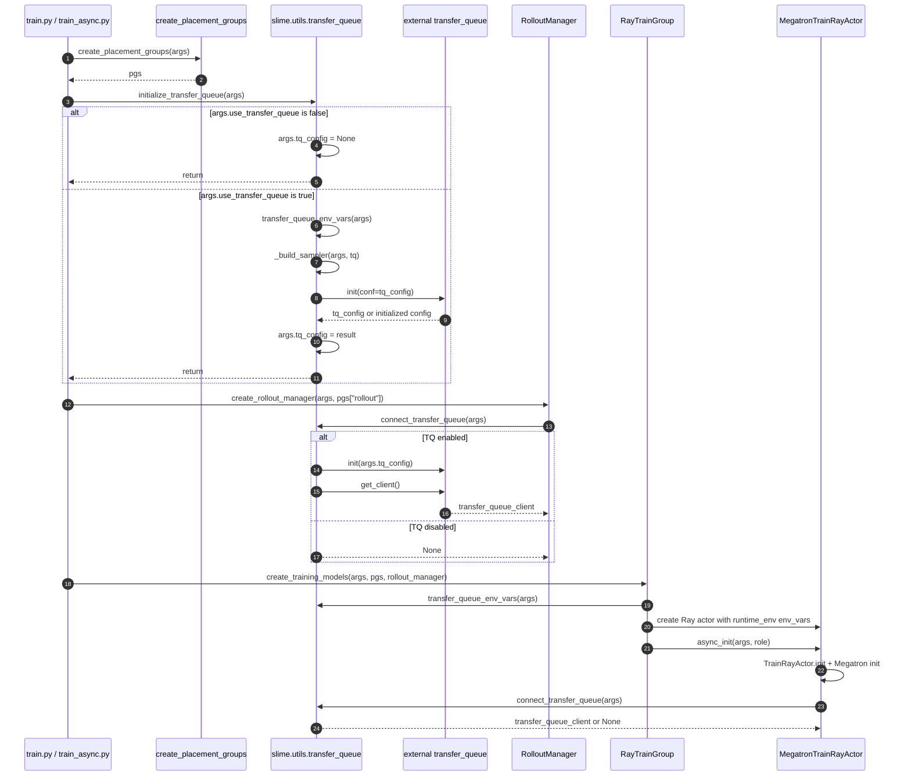
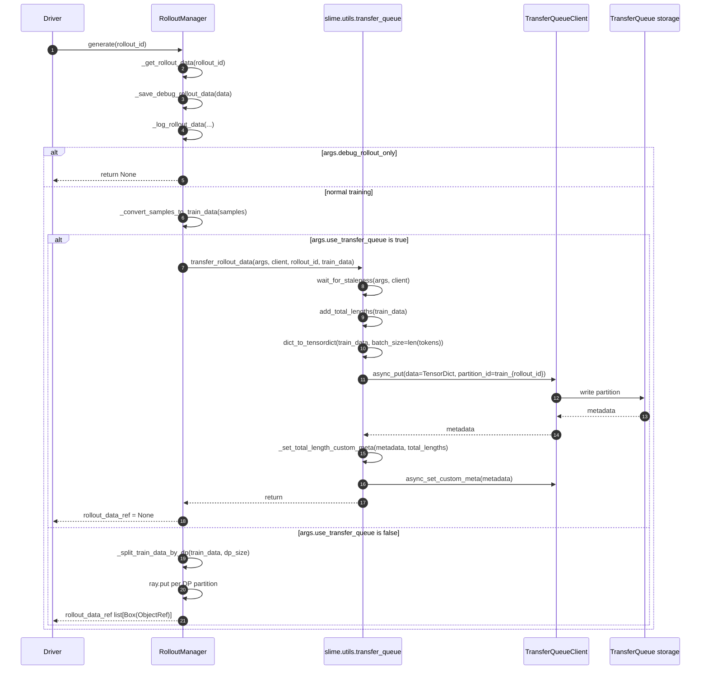
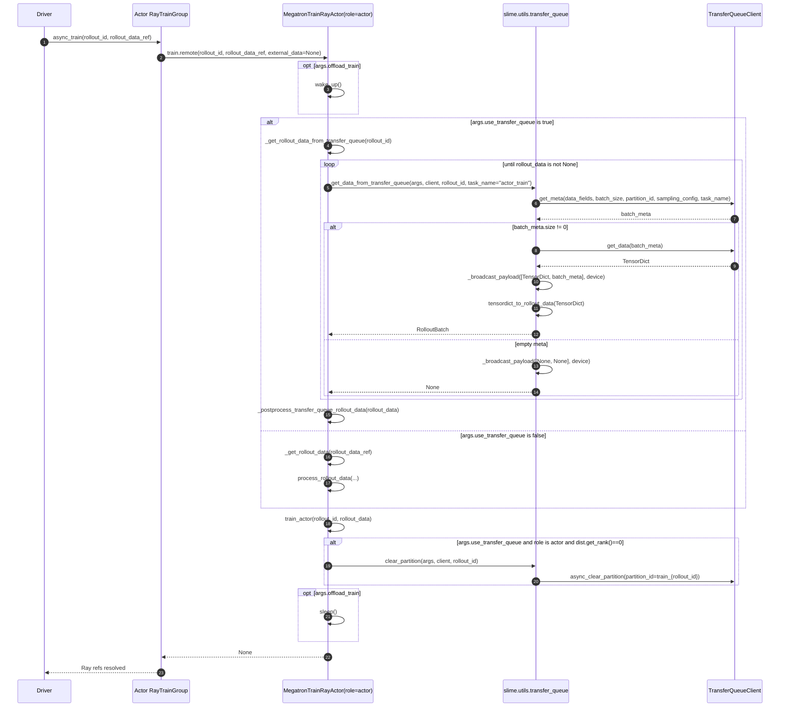
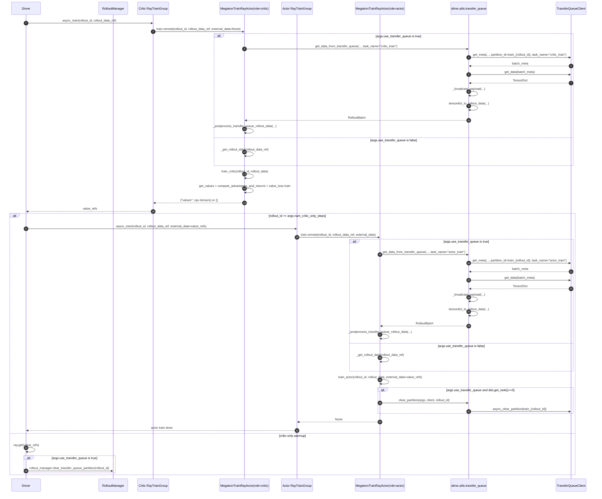
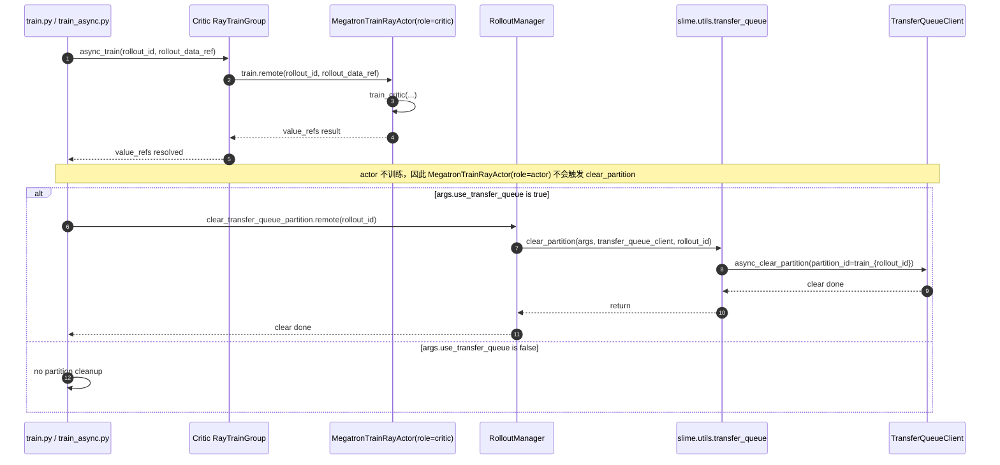
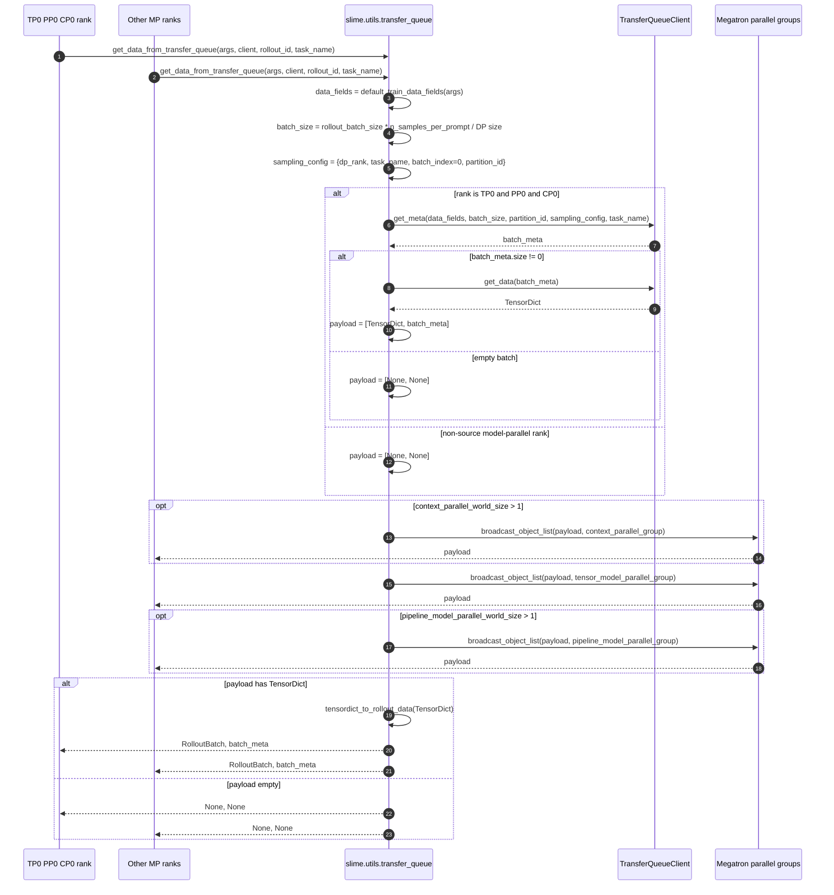
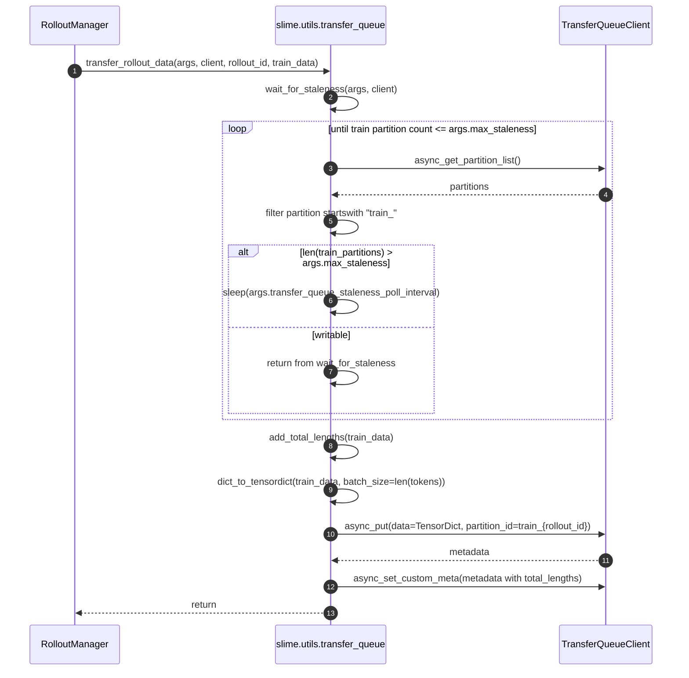
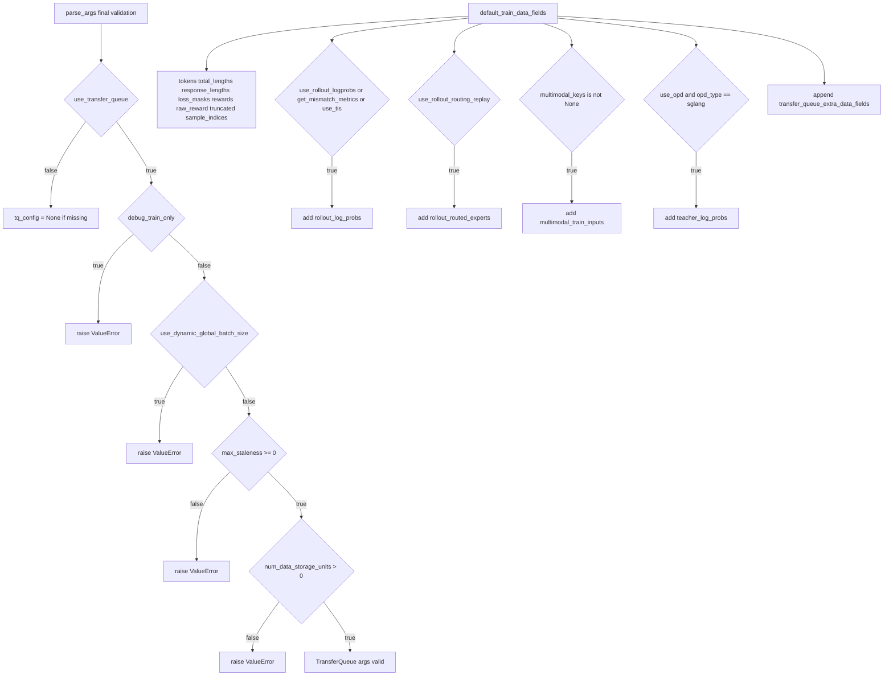

# slime TransferQueue 类图与时序图

本文档按最新 TransferQueue 提交生成：

- commit: `d2b2b3711b821cbc3c21628bda40be30813f2363`
- subject: `transfer_queue`
- 涉及文件：
  - `train.py`
  - `train_async.py`
  - `slime/ray/placement_group.py`
  - `slime/ray/rollout.py`
  - `slime/ray/actor_group.py`
  - `slime/backends/megatron_utils/actor.py`
  - `slime/utils/arguments.py`
  - `slime/utils/transfer_queue.py`
  - `tests/utils/test_transfer_queue_utils.py`

图中只表达该 commit 中已经存在的类、函数和调用关系；外部 TransferQueue/TensorDict 只列出本 commit 实际调用到的接口名。

## 1. 实际模块类图

```mermaid
classDiagram
    direction LR

    class TrainScript {
        <<train.py>>
        +train(args)
    }

    class TrainAsyncScript {
        <<train_async.py>>
        +train(args)
    }

    class PlacementGroupModule {
        <<slime.ray.placement_group>>
        +create_placement_groups(args)
        +create_rollout_manager(args, pg)
        +create_training_models(args, pgs, rollout_manager)
        +allocate_train_group(args, num_nodes, num_gpus_per_node, pg, role)
    }

    class RayTrainGroup {
        <<slime.ray.actor_group>>
        +__init__(args, num_nodes, num_gpus_per_node, pg, num_gpus_per_actor, role)
        +_allocate_gpus_for_actor(pg, num_gpus_per_actor)
        +async_init(args, role, with_ref, with_opd_teacher)
        +async_train(rollout_id, rollout_data_ref, external_data)
        +set_rollout_manager(rollout_manager)
    }

    class RolloutManager {
        <<Ray actor>>
        +__init__(args, pg)
        +generate(rollout_id)
        +clear_transfer_queue_partition(rollout_id)
        +dispose()
        -_get_rollout_data(rollout_id)
        -_convert_samples_to_train_data(samples)
        -_split_train_data_by_dp(data, dp_size)
    }

    class TrainRayActor {
        <<base class>>
        +__init__(world_size, rank, master_addr, master_port)
        +init(args, role, with_ref, with_opd_teacher)
        +train(rollout_id, rollout_data_ref, external_data)
        +set_rollout_manager(rollout_manager)
    }

    class MegatronTrainRayActor {
        <<Ray actor implementation>>
        +init(args, role, with_ref, with_opd_teacher)
        +train(rollout_id, rollout_data_ref, external_data)
        +train_critic(rollout_id, rollout_data)
        +train_actor(rollout_id, rollout_data, external_data)
        -_get_rollout_data(rollout_data_ref)
        -_get_rollout_data_from_transfer_queue(rollout_id)
        -_postprocess_transfer_queue_rollout_data(rollout_data)
    }

    class TransferQueueUtils {
        <<slime.utils.transfer_queue>>
        +transfer_queue_enabled(args)
        +initialize_transfer_queue(args)
        +transfer_queue_env_vars(args)
        +connect_transfer_queue(args)
        +close_transfer_queue(args)
        +add_total_lengths(train_data)
        +dict_to_tensordict(data, batch_size, device)
        +transfer_rollout_data(args, client, rollout_id, train_data)
        +wait_for_staleness(args, client)
        +clear_partition(args, client, rollout_id)
        +partition_id(rollout_id)
        +default_train_data_fields(args)
        +get_data_from_transfer_queue(args, client, rollout_id, task_name, data_fields)
        +tensordict_to_rollout_data(data)
        -_build_sampler(args, tq)
        -_set_total_length_custom_meta(client, metadata, total_lengths)
        -_broadcast_payload(payload, device)
    }

    class ArgumentParser {
        <<slime.utils.arguments>>
        +parse_args(add_custom_arguments)
        +add_transfer_queue_arguments(parser)
    }

    class ExternalTransferQueue {
        <<external package>>
        +init(conf)
        +get_client()
        +close()
        +GRPOGroupNSampler(n_samples_per_prompt)
        +SeqlenBalancedSampler(n_samples_per_prompt, dp_size)
    }

    class TransferQueueClient {
        <<external client>>
        +async_put(data, partition_id)
        +async_set_custom_meta(metadata)
        +async_get_partition_list()
        +async_clear_partition(partition_id)
        +get_meta(data_fields, batch_size, partition_id, sampling_config, task_name)
        +get_data(batch_meta)
    }

    class TensorDict {
        <<external tensordict>>
    }

    TrainScript --> TransferQueueUtils : initialize_transfer_queue
    TrainAsyncScript --> TransferQueueUtils : initialize_transfer_queue
    TrainScript --> PlacementGroupModule : create pgs / actors
    TrainAsyncScript --> PlacementGroupModule : create pgs / actors
    PlacementGroupModule --> RolloutManager : create_rollout_manager
    PlacementGroupModule --> RayTrainGroup : create_training_models
    TrainScript --> RolloutManager : generate / clear partition
    TrainAsyncScript --> RolloutManager : generate / clear partition
    TrainScript --> RayTrainGroup : async_train
    TrainAsyncScript --> RayTrainGroup : async_train

    RayTrainGroup --> TransferQueueUtils : transfer_queue_env_vars
    RayTrainGroup --> MegatronTrainRayActor : creates Ray actors
    MegatronTrainRayActor --|> TrainRayActor

    RolloutManager --> TransferQueueUtils : connect / put / clear / close
    MegatronTrainRayActor --> TransferQueueUtils : connect / get / clear
    ArgumentParser --> TransferQueueUtils : args consumed by utils

    TransferQueueUtils --> ExternalTransferQueue : import and init
    TransferQueueUtils --> TransferQueueClient : client operations
    TransferQueueUtils --> TensorDict : serialize / deserialize
```

## 2. 初始化时序图

## 3. rollout 写入时序图

## 4. actor 无 critic 训练时序图

## 5. PPO critic + actor 时序图

## 6. critic-only warmup partition 清理时序图

## 7. TransferQueue 读取与模型并行广播时序图

## 8. staleness backpressure 时序图

## 9. 参数校验与字段选择图

